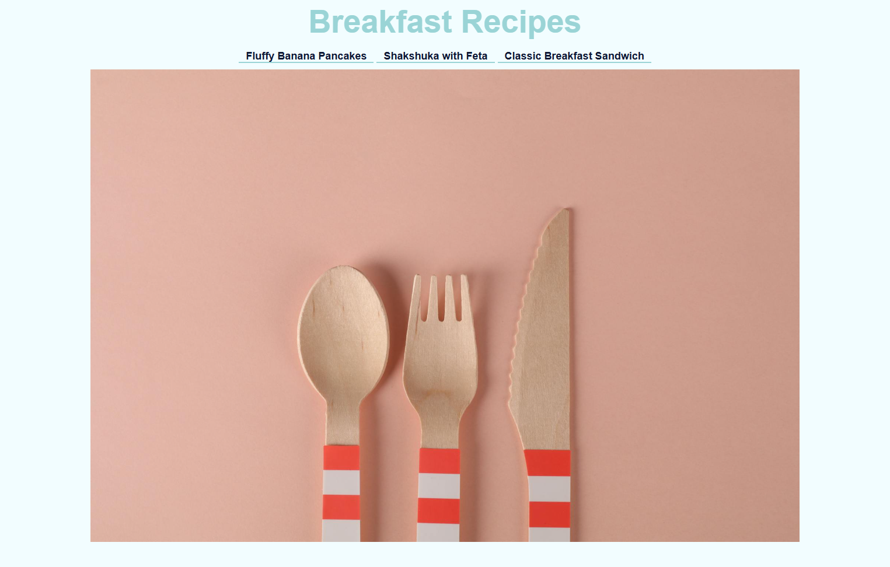
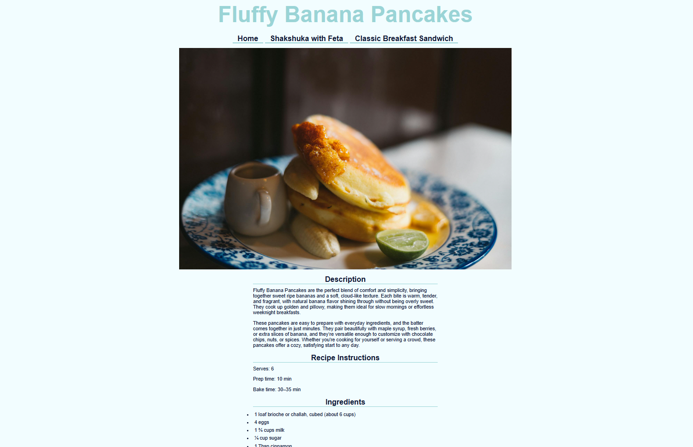

# Recipes Website 🍳🥞

**Recipes Website** is a multi-page web application built as part of The Odin Project curriculum. It features a curated collection of breakfast recipes complete with ingredients, step-by-step instructions, and custom styling.

[🌐 View Live Demo](https://cmatsagka.github.io/recipes-website/)





## 🌟 Key Features

- **Multi-Page Navigation:** Centralized homepage indexing multiple standalone recipe pages (Banana Pancakes, Shakshuka, and Breakfast Sandwich).
- **Detailed Recipe Pages:** Each recipe includes dedicated preparation instructions, ingredients lists, and styling.
- **Clean Design System:** Styled with a cohesive pastel palette, centered layouts, and clear typographic hierarchy.

---

## 🛠️ Tech Stack & Architecture

- **Markup:** Semantic HTML5 structure utilizing proper directory linking and lists.
- **Styling:** Modern CSS3 featuring clean typography, custom borders, and centered element layout.

---

## 🚀 Quick Start

Clone the repository:

```bash
git clone git@github.com:cmatsagka/recipes-website.git
```

Open the project directory:

```bash
cd recipes-website
```

---

## 📂 Project Structure

```text
recipes-website/
├── index.html       # Homepage showcasing the breakfast menu links
├── styles.css       # Global design system and layout styling
├── recipes/         # Individual recipe subpages
│   ├── banana-pancakes.html
│   ├── shakshuka.html
│   └── breakfast-sandwich.html
└── images/          # Preview screenshots and asset imagery
```

## 🎨 Attribution

Images: Stock photography provided by [Pexels](https://www.pexels.com/).
